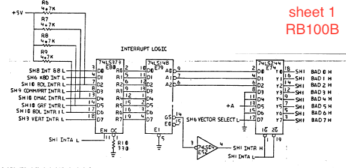
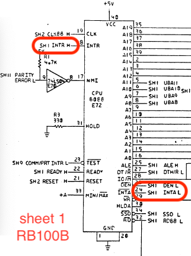
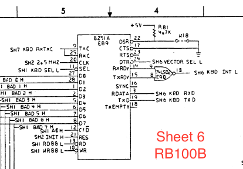
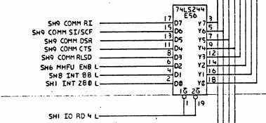
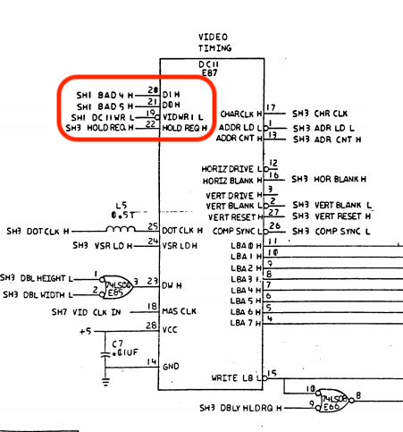
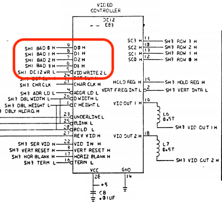

# Rainbow 100A/100B/100+/190 Notes

This document represents my notes, slightly organized, on what I've
learned about the DEC Ranibow. They pull in bits and pieces of
documentation, and have observations from reading through the
schematics, available sources, etc.

## Notes on Reading Schematics

"SHx SIGNAL [LH]" is the convention. SHx tells you that it's generated
on sheet X. L or H says it's active Low or Active High.

## Interrupts

The Rainbow has 8 interrupts that it can generate. These are
hard-wired on the motherboard from different sources. Unlike the
IBM-PC, there's no PIC chip. The Rainbow selects whatever line is
asserted based on priority.

| Interrupt | Source | Meaning |
|-----------|--------|---------|
| 27H | SH8 IN 88 L | Interrupt from the Z80 |
| 26H | SH6 KBD INT L | Keyboard interrupt from 8251A |
| 25H | SH10 BDL INTR L | Interrupt from expansion card (pin 23 J4) |
| 24H | SH9 COMM/PRT INTR L | Interrupt from the uPD7201 for shared comminucations and printer port |
| 23H | SH10 DMAC INTR L | Another interrupt from expansion card, used by advanced communications card to signal DMA complete (pin 5 J4) |
| 22H | SH10 GRF INTR L | Graphics card interrupt (pin 38 J7) |
| 21H | SH10 BDL INTR 1 L | Third interrupt from expansion card (pin 21 J4) |
| 20H | SH3 VERT INTR L | Vertical Blanking Interrupt (this is your timer) generated by DC12 |

Makes for a lovely machine to port DOS to given its use of INT 21H
for its system calls.... But I digress... or do I?

Has the circuit that puts the interrupt number on the bus during. We
feed all the interrupts into the 74LS373 (E80) Quad Latch. This is
latched when `SH1 INTA L` is asserted. The i8088 asserts this at the
right phase of the interrupt cycle so devices can put their data on
the bus. The 74LS148 (E79) 8-line to 3-line priority encoder picks the
D line with the highest number and outputs it on A0-A2 (inverted, so
D7 is output as 0, D6 as 1, and D0 as 7). This is how priority in
interrupts are selected... So those are fed into the 74LS244 (E74)
Octal Line buffer / driver with D5 wired high and D7 controlled by
`SH6 VECTOR SELECT L`. D5 is where the '2x' in all the above signals
comes from. But what the heck is this vector select thing. It's
generated here:

So the keyboard's DTR signal? What's up with that? Well, turns out
that the LK201 keyboard on the Rainbow is 4 wires: +12V, GND, RxD and
TxD so this is unused. The original Rainbow 100A lacked this circuit,
so DOS had to do what's best described as 'unnatural' things to
disambiguate between hardware and software interrupts, so DEC rixed
that with the 100B. There's now a ROM BIOS call to move the vectors.
All it does is set the register in the 8251A that controls DTR and
bam! The interrupts are moved starting with the next interrupt. DOS
really needs this, but CP/M and unix don't care. INTFIX.ASM from
the different copies of the MS-DOS BIOS has all the details on
what's needed to work around this...

### Unknonws

DOS has a CLKISR at INT 2C. Question: does the ROM call this? Check
the ROM BIOS docs / disassembly.  Normally, the ROM BIOS is at
interrupt 0x28 (40 decimal), but DOS moves it to 0x18. It also sets up
a FASTCON software interrupt at 0x29 that's little more than an thin
wrapper around `INT ROM`.

## Video

### Output

The Rainbow Docs talk about a RS-170-like signal. They talk about the
need to run it through a .1uF capasitor to turn it from AC coupled to
DC coupled. But that's it. Turns out that this signal is 'old school'
15kHz composite NTSC video. You can display it with any composite
monochrome monitor (like the ones for an apple 2c).

However, it isn't quite NTSC, since it's overscanned a bit. So many of
the modern NTSC to VGA/HDMI/LCD adapters won't dispaly the whole image.

### Monochrome Video Chips

The two video chips for the monochrome output are the DC11 and
DC12. These are the two chips used in the VT100 family of
terminals. You can find out about these chips with the VT100 Series
Video Terminal Technical Manual (order number EK-VT100-TM-003) now
available at bitkeepers:
http://www.bitsavers.org/pdf/dec/terminal/vt100/EK-VT100-TM-003_VT100_Technical_Manual_Jul82.pdf
section 4.6 "Video Processor" starting on pgae 4-48. the Timing Chip
is the DC11 and the Control Chip is the DC12.

It also documents the rather odd video display lists of characters as well.

## Communications / Printer

The Rainbow has a lot of weird shit in this area.

It uses the uPD7201, which is this rather obscure part with a data
sheet that's super terse. Why on earth would they use it? Turns out,
this part is a clone of the Z80-SIO chip, which was quite common in
Z80 designs and is much better documented when you look for it under
that name.

You'll also see '8274' which is the Intel part number.

PORT A:
Port address 2 reads modem signals
Port address 6 controls baud generation

PORT B:
No modem signals
Port address 0xe for baud generation

## Extended

20H for modem signals
21H for baud genertaion
29H Data port
2BH Status Port

## I/O PORTS

These are scraped from different places

symbol | value | description
------ | ----- | -----------
INTZ80 | 0H | Z80 Interrupt Port
KDP | 010H | Keyboard 8251 data port
KSP | 011H | Keyboard 8251 status port
AUXDP | 040H | Comm. 7201 data port
PRNDP | 041H | Printer 7201 data port
AUXP  | 042H | Comm. 7201 status port
PRNP  | 043H | Printer 7201 status port
RDBASE | 060H | Base of disk registers
DATA | 060H | Disk data register
WPRCMP | 061H | Disk precomp/error register
ERROR | 061H | Disk precomp/error register
SECTC | 062H | Disk sector count register
SECTN | 063H | Disk starting sector number register
CYLDL | 064H | Disk low cylinder number register
CYLDH | 065H | Disk high cylinder number register
SDH | 066H | Disk sector size, disk, and head reg
RDCMD | 067H | Disk command/status register
RDSTAT | 067H | Disk command/status register
RDCMD2 | 068H | Disk secondary command/status register
DSTAT0 | 068H | Disk secondary command/status register
DSTAT1 | 069H | Disk drive status register

There's a few more related to diagnostics defined in the schematic.

## Memory areas

EFFFEH is a word that contains system  parameter flags:

bit | Flag | Meaning 0 | Meaning 1
--- | ---- | --------- | ---------
0 | emulator | Console Mode | Terminal Mode
1 | On/Off Line | On-Line | Off-Line
2 | Set-Up Mode | Normal | Set-Up mode
3 | Hold Screen | Normal | Hold Scrn in effect
4 | Scroll I/P | Nomral | Sm Scroll in progress
5 | Reserved |
6 | Reserved |
7 | Print Screen Key | Not Pressed | Pressed
8 | Comm Opt Present | Present | No Present
9 | RX50-Ctrlr Bd | Present | No Present
10 | Graphics Bd | Present | No Present
11 | Comm Memory Option | Present | No Present
12 | Reserved |
13 | Reserved |
14 | Reserved |
15 | Reserved |

DOS sees bit 8 set and infers the presence of the hard disk controller by doing inb(0x68) & 0xe0 == 0xa0

It uses INT ROM DI==0xe to get clock rate

It also uses function 0xc to reset vectors for 02 (NMI for bad RAM)
20, 22, 23, 25, 26, and 2C which puts the graphics card and extended
option card into reset.

From schematic:

READ PORT | Signal
--------- | ------
0 | SH1 CLR88 L
8 | SH1 IORD2 L
2 | SH1 IORD4 L
A | SH1 IORD6 L

WRITE PORT | Signal
---------- | ------
0 | Something with SH1 INT Z80 L
2 | SH1 IO WR 4 L
A | SH1 IO WR 6 L
4 | SH1 DC11WR L
C | SH1 DC12WR L
6 | SH1 WR5016 H
E | SH1 WR BRG MUX L

16 PORTS AT | Signal
----------- | ------
40 | SH1 COMM/PRT SEL L
10 | SH1 KBD SEL L
50 | SH1 GRAPHICS SEL L
20 | SH1 BDL SEL1 L
60 | SH1 BDL SEL2 L
30 | SH1 BDL SEL3 L
70 | SH1 BDL SEL4 L

### Port 0x0

*READ:* Clears the interrupt from the Z80

*WRITE:* unclear... something to do with INTZ80

### Port 0x2

*READ:* Asserts `SH1 IORD4 L` which returns this register defined on sheet 6:

Note: Y7 is wired to D0, Y6 to D1, etc

Bit | Signal | Function
----|--------|---------
0x1 | SH1 INT Z80 L | Interrupt to the Z80 asserted
0x2 | SH8 INT 88 L | Interrupt to 8088 asserted
0x4 | SH6 MHFU ENB L | Is the Massive Hardware Fowl Up feature enabled?
0x8 | SH9 COMM RLSD | Realtime state of RLSD from Communications port pin 8
0x10 | SH9 COMM CTS | Realtime state of CTS from Communications port pin 5
0x20 | SH9 COMM DSR | Realtime state of DSR from Communications port pin 6
0x40 | SH9 COMM SI/SCF | Realtime state of SI/SCF from Communications port pin 12
0x80 | SH9 COMM RI | Realtime state of RI from Communications port pin 22

*WRITE:* Asserts `SH IO WR 4 L` which updates this register
....

### Port 0x4

*READ:* Nothing

*WRITE:* DC11 interface

From Sheet 3 of the schematic:

Bit | Meaning
----|--------
0x10 | Toggle D1H pin on DC11
0x20 | Toggle D0H pin on DC11

The D0H pin controls interlace. It appears that writing it then clearing it will toggle interlace mode.

The D1H pin controls 80 vs 132 columns. Tiggling it switches between the two.

Since this is just the Video Timing chip, if you switch between 80 and 132 columns, you'll need to adjust the linked lists of characters to display.

This table is in the VT-100 technical manual (page 4-55, table 4-6-1)

D0 | D1 | Configuration
---|----|--------------
0 | 0 | 80 Column Mode Interlaced
0 | 1 | 132 Column Mode Interlaced
1 | 0 | 60 Hz non interlaced
1 | 1 | 50 Hz non-interlaced

Writing to this port causes `VIDEO WR 1 L` pin to go low. This causes the DC11 to reset.

The table is a bit confusion, so I'll quote the section here (the
VT100 is controlled with the 8080):

4.6.2.1 Input Decoder - The input decoder responds to commands on the
`DO H` and `D1 H` pins (connected to 04 and 05 of the 8080 bus
respectively) whenever the `VIDEO WR 1 L` pin is low. The outputs of the
decoder select 80 / 132 column, 60 / 50 hertz refresh, and
interlacedjnoninterlaced modes of operation. Table 4-6-1 shows that
when `D1 H` is low the number of columns is programmed according to the
state of `DO H`, and when `D1 H` is high the refresh rate is
programmed. Interlaced mode is always selected when the column mode
is set, and noninterlaced mode is selected when the refresh rate is
set.  The interlace mode in use depends on whether "number of
columns" or "refresh rate" was selected last.

In addition to strobing data into the input decoder, `VIDEO WR 1 L` also
acts as a reset signal for the DCOII. Whenever `VIDEO WR 1 L` is low, the
counters in the DCOll are held in a cleared state. Resetting the
counters serves no purpose in the VT100 because the remainder of the
VT100 synchronizes itself to the DC11, but a reset is useful for
testing both individual chips and complete modules. Because writing
into the DC11 would cause the counters to reset and disturb the
display, this is never done unless the mode is being changed.

Accessed in Venix as a 16-bit port, though it likely doesn't matter.

### Port 0xC

Read: Nothing

Write: DC12 interface

From Sheet 3 of the schematic:

This writes the 4 bits (D0H through D3H) to the DC12 video controller. From the VT100 Technical manual, page 4-70, we have Table 4-6-2

D3 | D2 | D1 | D0 | Function
---|----|----|----|----------
0 | 0 | 0 | 0 | Load low order scroll latch = 00
0 | 0 | 0 | 1 | Load low order scroll latch = 01
0 | 0 | 1 | 0 | Load low order scroll latch = 10
0 | 0 | 1 | 1 | Load low order scroll latch = 11
0 | 1 | 0 | 0 | Load high order scroll latch = 00
0 | 1 | 0 | 1 | Load high order scroll latch = 01
0 | 1 | 1 | 0 | Load high order scroll latch = 10
0 | 1 | 1 | 1 | Load high order scroll latch = 11
1 | 0 | 0 | 0 | Toggle blink flip-flop
1 | 0 | 0 | 1 | Clear vertical frequency interrupt
1 | 0 | 1 | 0 | Set reverse field on
1 | 0 | 1 | 1 | Set reverse field off
1 | 1 | 0 | 0 | Set basic attribute to Underline *
1 | 1 | 0 | 1 | Set basic attribute to reverse video *
1 | 1 | 1 | 0 | reserved future *
1 | 1 | 1 | 1 | reserved future *

* Note: These functions also clear the blink flip-flip

http://bitsavers.trailing-edge.com/pdf/dec/terminal/vt100/EK-VT100-TM-003_VT100_Technical_Manual_Jul82.pdf
is the manual, and has all the detail if you wanted to implement the
VT100 in firmware. However, the Rainbow already has a full terminal
emulator embedded in it, so knowing too much will wind up fighting the
firmware. It's unclear if this is a good or a bad thing... It would,
however, be a large thing.

The Rainbow's firmware uses the vertical refresh interrupt to do
smooth scrolling, cursor blinking, clearing the vertical frequency
interrupt, etc.
